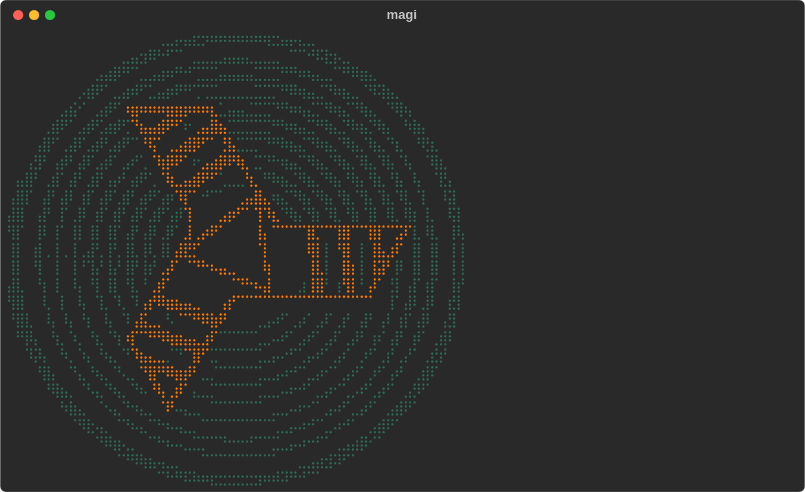
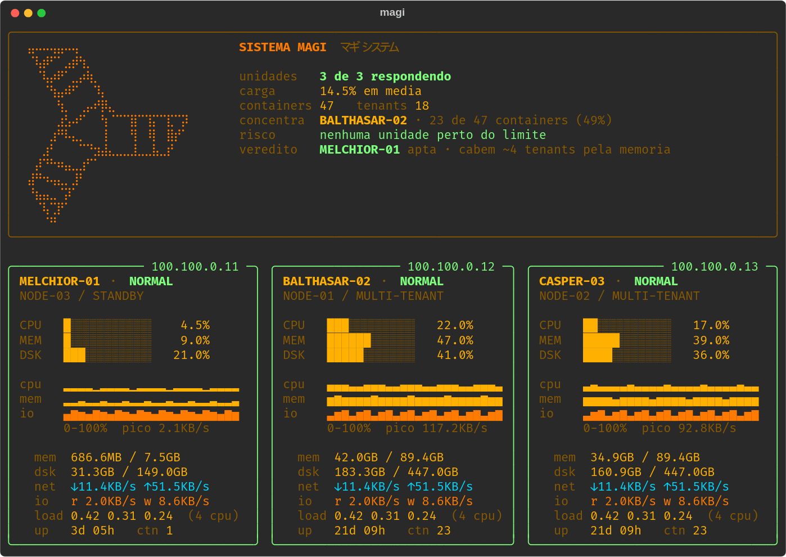
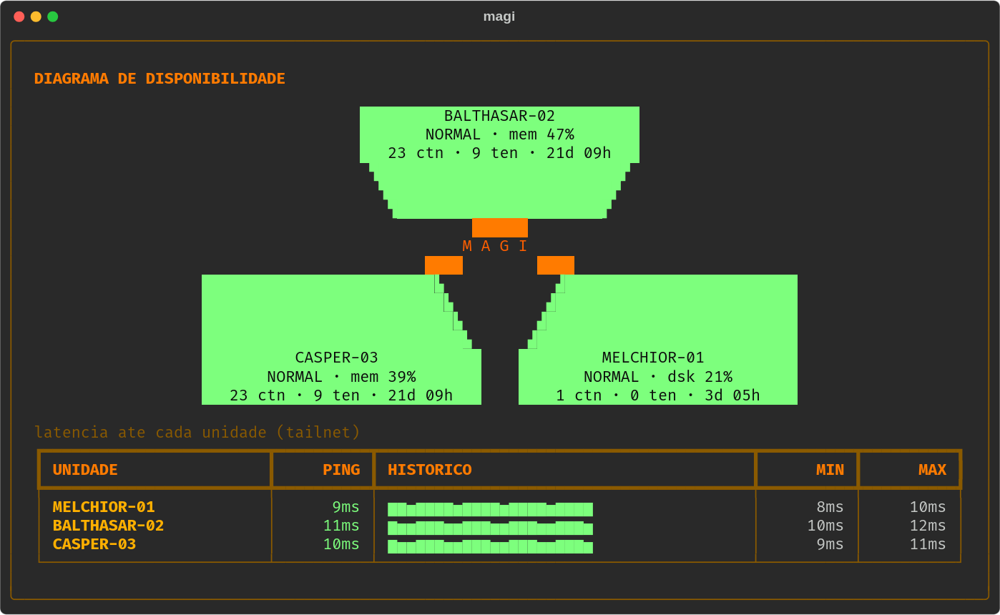

# MAGI

A terminal dashboard for a small server cluster, styled after the MAGI system
from *Neon Genesis Evangelion*.

It pulls live metrics straight from each node and answers the question a
monitoring dashboard usually leaves to you: **not just how loaded the machines
are, but which one should take the next workload, and what is stopping the
others.**

Built twice, once in Python and once in Rust, which turned out to be the most
interesting part of the project. More on that below.



---

## What it does



Five tabs, all driven by live data:

| Tab | What it shows |
|---|---|
| `GERAL` | all nodes side by side, plus the verdict (see below) |
| one per node | host detail and the container table, sorted by CPU |
| `DIAGRAMA` | the MAGI status screen, with each node's bottleneck |

### The verdict

Most dashboards tell you a number is high. This one tries to tell you what to
do about it. Three lines answer *"where does the next workload go?"*:

- **`concentra`** — which node carries the largest share of containers
- **`risco`** — which resource runs out first, and on which node
- **`veredito`** — which node is fit to receive work, and roughly how much
  still fits

The logic that makes this work is picking the **bottleneck**: the tightest of
CPU, memory and disk, because that is what actually limits what fits on a
machine. In my cluster one node sits nearly empty but cannot take anything,
because its disk is at 92%. A plain dashboard shows one red bar among many
green ones. This one names the constraint.

Two details that matter for the number to be trustworthy:

- CPU is read from the **history average**, not the instantaneous sample. The
  raw reading swings enough that the verdict would pick a different node every
  frame, which is useless for deciding anything.
- The capacity estimate is memory-based, using the average footprint of the
  workloads already running. When the constraint is a *different* resource, the
  line says so instead of promising headroom that disk or CPU will not allow.

### The MAGI screen



Three filled blocks in a triangle with the label knocked out in black, chamfered
corners pointing at the centre. The block colour *is* the node state, so the
whole screen changes together, which is the "ALL GREEN" effect from the show.

Each block carries its own bottleneck, so the picture says what is wrong and
not merely that something is.

---

## The logo

The mark is derived from the reference artwork, not hand-drawn in ASCII. I tried
hand-drawing it first and it looked like a poor imitation, for a reason that is
obvious in hindsight: **thin strokes and rotated text do not exist in a
character grid.**

What made it work was rendering with **Braille characters** (U+2800). A Braille
cell carries 2×4 sub-pixels, against 1×2 for a half-block and 2×2 for a
quadrant. It is the right cell for line art, and the same trick plotting
libraries use to draw curves in a terminal.

Two more things were needed:

- **Outline, not fill.** An earlier attempt filled the bands so they would
  survive downscaling, and the mark became a solid blob, the opposite of the
  reference. The filled silhouette is only an intermediate step; the outline is
  extracted from it and that is what reaches the screen.
- **Max-pooling, not averaging.** Averaging erases a thin line during
  downscaling. Taking the maximum lights any sub-pixel the line touches.

The concentric rings only cover the top half in the source art. The generator
measures the centre and radii of the existing arcs and closes the circles at
those same radii, so the irregular original stroke stays where it exists and
only the missing part is drawn.

`ferramentas/gerar_logo.py` does all of this and emits the encoded cells. The
programs ship the result, so neither needs Pillow or the image at runtime.

---

## Two implementations

The Python version came first. I later rewrote it in Rust to see what would
change, and measured both under identical conditions: same 106×40 window, same
cluster, 12 seconds of runtime.

| | CPU | Memory (RSS) | Distribution |
|---|---|---|---|
| **Rust** | 0.08 s | 6.5 MB | one 2.7 MB binary |
| **Python** | 1.28 s | 37.2 MB | needs Python + `rich` |

16× less CPU and about 6× less memory. But the number I found most interesting
was a different one.

I assumed the win would come from parsing metrics, since that is the part that
runs three times a second over ~85 KB per node. Benchmarked against a real
payload, both parsers produce **exactly the same 1059 metrics**, and Rust is only
**2.2× faster** at it (0.54 ms against 1.19 ms).

Working it out: 3 nodes × 1/s × 1.19 ms is roughly 43 ms over 12 seconds, about
3% of Python's 1.28 s. **Almost the entire cost was the rendering library
redrawing the interface four times a second, not the data collection.** If the
goal had only been to save CPU, changing the render library would have paid off
more than changing language.

What Rust genuinely buys here:

- **Distribution becomes copying a file.** No interpreter, no dependency
  install on each server.
- **Real parallelism in collection.** In Python the threads contend for the GIL
  exactly during parsing, which is pure CPU work. Irrelevant with 3 nodes;
  not irrelevant with 20.
- **A concurrency bug the compiler would not let me write.** The port forced me
  to split `buscar` (network, outside the lock) from `aplicar` (parse, holding
  it), because in Rust the mutex owns the data, so holding it across a 3.5 s
  HTTP call is visible in the code. In Python the lock is a convention and it is
  easy not to notice.

And what it costs, honestly: rebuilding takes ~17 s per change against saving a
file, and the logo data becomes a compile-time constant.

Both versions are kept in the repository and behave identically.

---

## Running it

The node list is **not** in the source. Each installation has its own, so the
program reads it from a config file:

```bash
cp magi.example.json magi.json
$EDITOR magi.json
```

It looks for `$MAGI_CONFIG`, then `./magi.json`, then
`~/.config/magi/config.json`.

**Python** (needs `rich`):

```bash
pip install rich
./magi
```

**Rust:**

```bash
cd rust && cargo build --release
./target/release/magi
```

| Key | Action |
|---|---|
| `1`–`5`, arrows | switch tab |
| `TAB` | cycle tabs |
| `r` | force a container refresh |
| `q` | quit |

Environment: `MAGI_PROM` overrides the Prometheus URL, `MAGI_SEM_RESIZE=1`
disables the window resize request.

### Requirements

- Each node running [`node_exporter`](https://github.com/prometheus/node_exporter)
  on port 9100, reachable from wherever you run this
- Optionally a Prometheus scraping cAdvisor, for the container table and for
  seeding the history graphs. Without it the tool still works; the container
  tab is just empty and the graphs start from zero.

---

## Notes on the implementation

Things that cost me time and are worth not rediscovering:

- `node_boot_time_seconds` comes from the `stat` collector, not `time`. Without
  it uptime reads zero.
- Collection is parallel, one thread per node. Sequential took 3.5 s per cycle,
  parallel takes 0.92 s.
- The CPU and memory graphs use an absolute 0–100% scale but with a square
  root applied. On a linear scale, low utilisation (CPU at 1%) rounds to level
  zero, which is blank, and the graph disappears.
- The I/O graph has no natural ceiling, so it scales to its own peak with 30%
  headroom. Without the headroom it sits permanently at full and reads as a
  solid bar.
- **Red is reserved for total unavailability.** A disk at 92% is serious but the
  machine is up, so the top of the usage scale is a strong orange. State labels
  and values use the same scale, otherwise a label and the number that caused it
  appear in different colours.
- Chamfered corners use three-quadrant blocks (`▟▙▜▛`) rather than geometric
  triangles (`◢◣◤◥`). Triangles do not fill the cell in most fonts and the
  diagonal comes out dotted.
- The metrics fetch filters collectors
  (`?collect[]=cpu&meminfo&filesystem&...`), which drops the response from
  166 KB to 82 KB per machine. Pulling containers from cAdvisor directly was
  not viable: 5.2 MB raw per call, against a few KB from Prometheus.

---

## Credits

The MAGI system, and the names MELCHIOR, BALTHASAR and CASPER, are from *Neon
Genesis Evangelion* (Gainax). This is a fan project, not affiliated with or
endorsed by the rights holders. The mark rendered in the terminal is a
heavily abstracted derivative of reference artwork, generated by the script in
`ferramentas/`; the source image is not distributed here.

## License

MIT. See [LICENSE](LICENSE).
